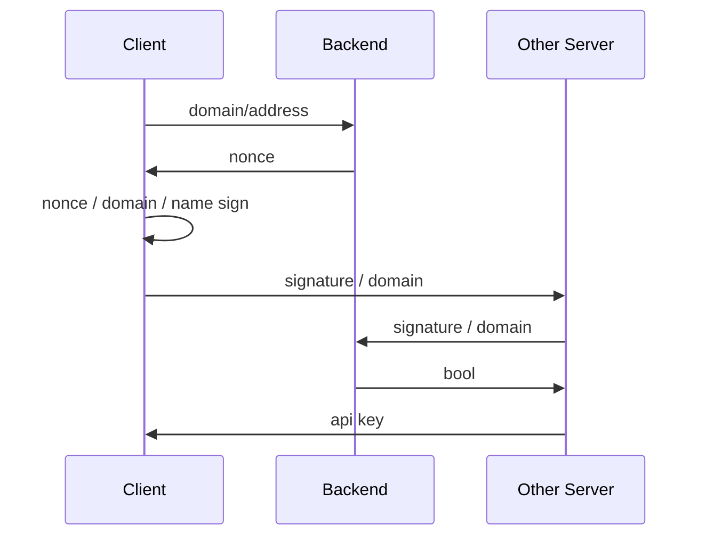

This is an API developed using the [Hono](https://hono.dev/) framework running on Cloudflare Workers. The API aims to integrate users within the Wrap Protocol to log in using their usernames from the ANS system.

## Quick Start

This project utilizes [bun](https://bun.run/) as a build and package management tool. Before running this system, you need to install bun:

```bash
curl -fsSL https://bun.sh/install | bash
```

Then, use `bun install` to install project dependencies. Since this system utilizes Cloudflare's KV database, you need to configure `wrangler.toml` for the project as follows:

```toml
name = "wrap-siwe-backend"
compatibility_date = "2023-12-01"

[[kv_namespaces]]
binding = "Web3Login"
id = ""

```

Here, configuration should be based on the developer's Cloudflare KV database options. Once configured, you can run the project locally using `bun run dev` and deploy the project using `bun run deploy`.

## Preparation

To ensure you can test this project properly, you need to obtain an NFT within the Wrap Protocol. Currently, it can only be obtained through a script and requires spending **0.0105 ETH** on the **Sepolia test network**.

You need to first clone [WrapScript](https://github.com/wangshouh/WrapScript) locally, then execute `bun install`, wait for dependencies to be installed, and finally execute the `bun user.ts` command. Then, choose `Wrap`, `0x84D85a77a28282d1aB339a5F671e79202d015346` sequentially and use ETH to obtain the specified NFT.

## Specification



The frontend first needs to determine the user's Ethereum address, then make a call to the `/nonce` endpoint using the following request body:

```json
{
	"address": "<User's Ethereum Address>",
	"domain": "<Login Domain>"
}
```

The backend will return a random `nonce` value, which is valid for 60 seconds after generation. The response interface is as follows:

```
1641254225
```

Upon receiving this value, the frontend asks the user to sign the following content with their private key:

```
<Login Domain> wants you to sign in with your Wrap Name:
<Login Wrap Name>

Version: 1
Nonce: <Login Nonce>
```

Here, `Login Wrap Name` refers to the name of the NFT the user holds within the Wrap Protocol in ANS. Use the obtained signature to make a call to the `/verify` endpoint, which requires the following request body:

```json
{
	"dotAgency": "<ANS Name>",
	"signature": "<signature>"
}
```

If the user is the owner of `ANS Name`, the backend returns `true`; otherwise, it returns `false`.

## Reference

You can use the following script for testing:

```typescript
import { env } from "bun"
import { privateKeyToAccount } from "viem/accounts"

const generateMessage = (domain: string, name: string, nonce: string) => {
    const message = 
`${domain} wants you to sign in with your Wrap Name:
${name}

Version: 1
Nonce: ${nonce}`

    return message
}
  
const accountAddress = ""
const accountWrap = ""
const domainName = ""

const signAccount = privateKeyToAccount(env.PRIVATE_KEY as `0x${string}`)

const nonceReq = fetch(
    "https://siwe.ccipgateway.xyz/nonce",
    {
        body: JSON.stringify({
            address: accountAddress.toLocaleLowerCase(),
            domain: domainName
        }),
        headers: {
            "Content-Type": "application/json"
        },
        method: "POST"
    }
)

const nonce = await (await nonceReq).text()

const signature = await signAccount.signMessage({
    message: generateMessage(domainName, accountWrap, nonce)
})

const verifyReq = fetch(
    "https://siwe.ccipgateway.xyz/verify",
    {
        body: JSON.stringify({
            dotAgency: accountWrap,
            domain: domainName,
            signature
        }),
        headers: {
            "Content-Type": "application/json"
        },
        method: "POST"
    }
)

const verifyRes = await (await verifyReq).text()

console.log(verifyRes)
```

Here, the deployed WrapScript project is used, with the address being `https://siwe.ccipgateway.xyz/verify`. You need to fill in the `accountAddress`, `accountWrap`, and `domainName` variables within the script, representing the user's Ethereum address, the name of the NFT the user holds, and the URL of the login page.